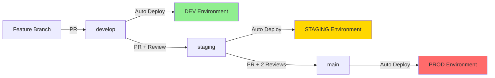

# CI/CD Pipeline Architecture

This document provides visual representations of the CI/CD pipeline architecture.

## Branch and Deployment Flow



## CI/CD Workflow Stages

```
┌─────────────────────────────────────────────────────────────────┐
│                     Pull Request Created                         │
│                     (Any branch → develop)                       │
└────────────────────────┬────────────────────────────────────────┘
                         ↓
┌─────────────────────────────────────────────────────────────────┐
│                      CI Pipeline Triggered                       │
├─────────────────────────────────────────────────────────────────┤
│  ┌──────────────┐  ┌──────────────┐  ┌──────────────┐          │
│  │     Lint     │→ │   Security   │→ │  Build &     │          │
│  │   Validate   │  │     Scan     │  │     Test     │          │
│  └──────────────┘  └──────────────┘  └──────────────┘          │
│         ↓                 ↓                  ↓                   │
│       PASS              PASS               PASS                  │
└────────────────────────┬────────────────────────────────────────┘
                         ↓
┌─────────────────────────────────────────────────────────────────┐
│                   Code Review & Approval                         │
└────────────────────────┬────────────────────────────────────────┘
                         ↓
┌─────────────────────────────────────────────────────────────────┐
│                    Merge to develop Branch                       │
└────────────────────────┬────────────────────────────────────────┘
                         ↓
┌─────────────────────────────────────────────────────────────────┐
│              DEV Deployment Workflow Triggered                   │
├─────────────────────────────────────────────────────────────────┤
│  1. Configure kubectl (DEV cluster)                             │
│  2. Create/verify namespace (camel-k-dev)                       │
│  3. Install Camel K operator                                    │
│  4. Deploy integration (DEBUG mode)                             │
│  5. Verify deployment                                           │
│  6. Store deployment metadata                                   │
└────────────────────────┬────────────────────────────────────────┘
                         ↓
┌─────────────────────────────────────────────────────────────────┐
│                     Testing in DEV                              │
│              (Manual verification by team)                       │
└────────────────────────┬────────────────────────────────────────┘
                         ↓
┌─────────────────────────────────────────────────────────────────┐
│             Create PR: develop → staging                         │
│                  (After approval)                                │
└────────────────────────┬────────────────────────────────────────┘
                         ↓
┌─────────────────────────────────────────────────────────────────┐
│           STAGING Deployment Workflow Triggered                  │
├─────────────────────────────────────────────────────────────────┤
│  1. Configure kubectl (STAGING cluster)                         │
│  2. Create/verify namespace (camel-k-staging)                   │
│  3. Install Camel K operator                                    │
│  4. Deploy integration (INFO mode, Prometheus)                  │
│  5. Run smoke tests                                             │
│  6. Verify deployment                                           │
│  7. Store deployment metadata                                   │
└────────────────────────┬────────────────────────────────────────┘
                         ↓
┌─────────────────────────────────────────────────────────────────┐
│                   Testing in STAGING                            │
│          (UAT, Integration tests, Performance)                   │
└────────────────────────┬────────────────────────────────────────┘
                         ↓
┌─────────────────────────────────────────────────────────────────┐
│              Create PR: staging → main                           │
│             (Requires 2 approvals)                               │
└────────────────────────┬────────────────────────────────────────┘
                         ↓
┌─────────────────────────────────────────────────────────────────┐
│            PROD Deployment Workflow Triggered                    │
├─────────────────────────────────────────────────────────────────┤
│  1. Backup current deployment                                   │
│  2. Configure kubectl (PROD cluster)                            │
│  3. Create/verify namespace (camel-k-prod)                      │
│  4. Install Camel K operator                                    │
│  5. Deploy integration (Production config)                      │
│  6. Run health checks                                           │
│  7. Validate logs for errors                                    │
│  8. Create Git tag (version)                                    │
│  9. Store deployment metadata + backup                          │
└────────────────────────┬────────────────────────────────────────┘
                         ↓
┌─────────────────────────────────────────────────────────────────┐
│                 Production Monitoring                            │
│        (Prometheus, Health checks, Log analysis)                 │
└─────────────────────────────────────────────────────────────────┘
```

## Environment Promotion Flow

```
┌──────────────────┐
│  Developer       │
│  Local Testing   │
└────────┬─────────┘
         │ git push
         ↓
┌────────────────────────────┐
│  Feature Branch            │
│  • Local development       │
│  • No auto-deployment      │
└────────┬───────────────────┘
         │ PR to develop
         ↓
┌────────────────────────────┐     ┌──────────────────┐
│  develop Branch            │────→│  DEV Environment │
│  • CI validation           │     │  camel-k-dev     │
│  • Code review             │     │  DEBUG logging   │
│  • Auto-deploy on merge    │     │  Fast iteration  │
└────────┬───────────────────┘     └──────────────────┘
         │ PR to staging
         ↓
┌────────────────────────────┐     ┌──────────────────────┐
│  staging Branch            │────→│  STAGING Environment │
│  • CI validation           │     │  camel-k-staging     │
│  • Code review (1)         │     │  INFO logging        │
│  • Auto-deploy on merge    │     │  Smoke tests         │
│  • Smoke tests             │     │  Prometheus metrics  │
└────────┬───────────────────┘     └──────────────────────┘
         │ PR to main (2 reviews)
         ↓
┌────────────────────────────┐     ┌──────────────────────┐
│  main Branch               │────→│  PROD Environment    │
│  • CI validation           │     │  camel-k-prod        │
│  • Code review (2)         │     │  INFO logging        │
│  • Branch protection       │     │  Health checks       │
│  • Auto-deploy on merge    │     │  Full monitoring     │
│  • Backup before deploy    │     │  Resource limits     │
│  • Git tag created         │     │  Rollback ready      │
└────────────────────────────┘     └──────────────────────┘
```

## Security and Quality Gates

```
┌─────────────────────────────────────────────────────────┐
│                    Code Commit                          │
└────────────────────┬────────────────────────────────────┘
                     ↓
              ┌──────────────┐
              │ Gate 1: Lint │
              │ & Validate   │
              └──────┬───────┘
                     ↓ PASS
              ┌──────────────┐
              │ Gate 2:      │
              │ Security     │
              │ Scanning     │
              └──────┬───────┘
                     ↓ PASS
              ┌──────────────┐
              │ Gate 3:      │
              │ Build & Test │
              └──────┬───────┘
                     ↓ PASS
              ┌──────────────┐
              │ Gate 4:      │
              │ Code Review  │
              └──────┬───────┘
                     ↓ APPROVED
              ┌──────────────┐
              │ Gate 5:      │
              │ Branch       │
              │ Protection   │
              └──────┬───────┘
                     ↓ MERGE
┌─────────────────────────────────────────────────────────┐
│              Deployment to Environment                  │
└─────────────────────────────────────────────────────────┘
```

## Rollback Strategy

```
┌────────────────────────────────────────────────────────┐
│         Production Deployment Initiated                │
└───────────────────┬────────────────────────────────────┘
                    ↓
         ┌──────────────────────┐
         │  Create Backup       │
         │  (Integration YAML)  │
         └──────────┬───────────┘
                    ↓
         ┌──────────────────────┐
         │  Deploy New Version  │
         └──────────┬───────────┘
                    ↓
         ┌──────────────────────┐
         │   Health Checks      │
         └──────────┬───────────┘
                    ↓
              ┌─────┴─────┐
              │           │
           PASS         FAIL
              │           │
              ↓           ↓
    ┌─────────────┐   ┌──────────────────┐
    │  Success!   │   │  Rollback Alert  │
    │  Monitor    │   │  Manual Action   │
    └─────────────┘   └────────┬─────────┘
                               ↓
                    ┌──────────────────────┐
                    │  Download Backup     │
                    │  from Artifacts      │
                    └──────────┬───────────┘
                               ↓
                    ┌──────────────────────┐
                    │  kubectl apply -f    │
                    │  backup/             │
                    └──────────┬───────────┘
                               ↓
                    ┌──────────────────────┐
                    │  Verify Rollback     │
                    │  Service Restored    │
                    └──────────────────────┘
```

## Multi-Environment Resource Flow

```
┌─────────────────────────────────────────────────────────────┐
│                     Git Repository                          │
│  ┌─────────────┐  ┌─────────────┐  ┌─────────────┐        │
│  │   develop   │  │   staging   │  │     main    │        │
│  └──────┬──────┘  └──────┬──────┘  └──────┬──────┘        │
└─────────┼─────────────────┼─────────────────┼──────────────┘
          │                 │                 │
          ↓                 ↓                 ↓
┌─────────────────────────────────────────────────────────────┐
│                  GitHub Actions Runners                     │
│  ┌─────────────┐  ┌─────────────┐  ┌─────────────┐        │
│  │ Deploy-Dev  │  │Deploy-Stage │  │ Deploy-Prod │        │
│  │  Workflow   │  │  Workflow   │  │  Workflow   │        │
│  └──────┬──────┘  └──────┬──────┘  └──────┬──────┘        │
└─────────┼─────────────────┼─────────────────┼──────────────┘
          │                 │                 │
          │ kubeconfig      │ kubeconfig      │ kubeconfig
          │ (secret)        │ (secret)        │ (secret)
          ↓                 ↓                 ↓
┌─────────────────────────────────────────────────────────────┐
│                   Kubernetes Clusters                       │
│  ┌─────────────┐  ┌─────────────┐  ┌─────────────┐        │
│  │ DEV Cluster │  │STAGE Cluster│  │ PROD Cluster│        │
│  │             │  │             │  │             │        │
│  │ Namespace:  │  │ Namespace:  │  │ Namespace:  │        │
│  │ camel-k-dev │  │camel-k-stg  │  │camel-k-prod │        │
│  │             │  │             │  │             │        │
│  │ Integration:│  │ Integration:│  │ Integration:│        │
│  │ consumer-   │  │ consumer-   │  │ consumer-   │        │
│  │   dev       │  │   staging   │  │   prod      │        │
│  └─────────────┘  └─────────────┘  └─────────────┘        │
└─────────────────────────────────────────────────────────────┘
```

## Deployment Timeline

```
Time: 0m          3m          8m          15m         25m
      │           │           │           │           │
      ↓           ↓           ↓           ↓           ↓
      
PR    Merge to    Deploy to   Testing     Merge to    Deploy to
Created  develop     DEV       in DEV      staging     STAGING
│                    │                                 │
│                    └─ Auto (3-5 min) ───────────────┘
│                                                      │
└────── CI (5-10 min) ────────────────────────────────┘

Time: 30m         35m         45m         52m
      │           │           │           │
      ↓           ↓           ↓           ↓
      
Testing     Merge to    Deploy to   Monitoring
in STAGING     main        PROD      & Verification
│                         │
└─ Auto (5-7 min) ────────┘
                          │
                          └─ Auto (7-10 min) ───┘
                          └─ Health checks
                          └─ Backup created
                          └─ Git tag created
```

## Monitoring and Observability

```
┌─────────────────────────────────────────────────────────────┐
│                   GitHub Actions Dashboard                  │
│  • Workflow execution status                                │
│  • Build logs and deployment logs                           │
│  • Artifact downloads (deployments, backups)                │
│  • Deployment history and audit trail                       │
└─────────────────────┬───────────────────────────────────────┘
                      │
        ┌─────────────┼─────────────┐
        ↓             ↓             ↓
┌───────────┐ ┌───────────┐ ┌───────────┐
│    DEV    │ │  STAGING  │ │   PROD    │
└─────┬─────┘ └─────┬─────┘ └─────┬─────┘
      │             │             │
      ↓             ↓             ↓
┌─────────────────────────────────────────────────────────────┐
│              Kubernetes Monitoring Layer                    │
│  ┌──────────────────┐  ┌──────────────────┐               │
│  │  kubectl logs    │  │  kubectl get     │               │
│  │  kubectl events  │  │  kubectl describe│               │
│  └──────────────────┘  └──────────────────┘               │
└─────────────────────────────────────────────────────────────┘
      │
      ↓
┌─────────────────────────────────────────────────────────────┐
│              Application Monitoring Layer                   │
│  ┌──────────────────┐  ┌──────────────────┐               │
│  │  Prometheus      │  │  Health Checks   │               │
│  │  Metrics         │  │  Endpoints       │               │
│  └──────────────────┘  └──────────────────┘               │
└─────────────────────────────────────────────────────────────┘
```

---

## Key Principles

1. **Automation First**: All deployments are automated via Git commits
2. **Environment Parity**: Configurations progress from dev → staging → prod
3. **Safety Gates**: Multiple validation layers before production
4. **Rollback Ready**: Automatic backups before production deployments
5. **Audit Trail**: Complete history of all deployments and changes
6. **Security by Default**: Automated security scanning on every PR

---

*For detailed implementation, see [SDLC-PIPELINE.md](../SDLC-PIPELINE.md)*
